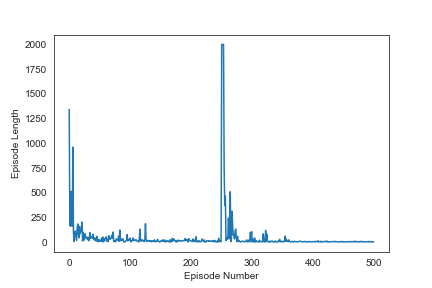

This is an implementation of the paper *Cooperative and Distributed Reinforcement Learning of Drones for Field Coverage* by Huy Xuan Pham, et al. with an extension which measures the robustness of their proposed solution with respect to minor environmental perturbations.

# Experiments:
## 1. Static FOV and Static FOI (Baseline)
`python main.py foi-0.csv output_1 --n_drones 2 --env_dim 7 7 4 --seed 0`

## 2. FOI Translation
`python main.py foi-0.csv output_2 --n_drones 2 --env_dim 7 7 4 --seed 0 --perturb_foi foi-1.csv 250`

## 3. FOV Widening
`python main.py foi-0.csv output_3 --n_drones 2 --env_dim 7 7 4 --seed 0 --perturb_fov 45 250`

## 4. FOI Widening and New FOI (1)
`python main.py foi-0.csv output_4 --n_drones 2 --env_dim 7 7 4 --seed 0 --perturb_foi foi-2.csv 250 --perturb_fov 45 250`

## 5. FOI Widening and New FOI (2)
`python main.py foi-0.csv output_5 --n_drones 2 --env_dim 7 7 4 --seed 0 --perturb_foi foi-3.csv 250 --perturb_fov 45 250`

---
[Full Writeup](static/writeup.pdf)
